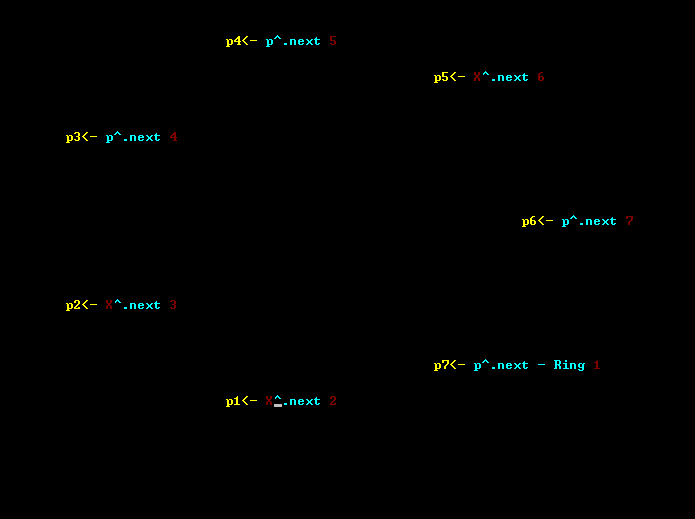
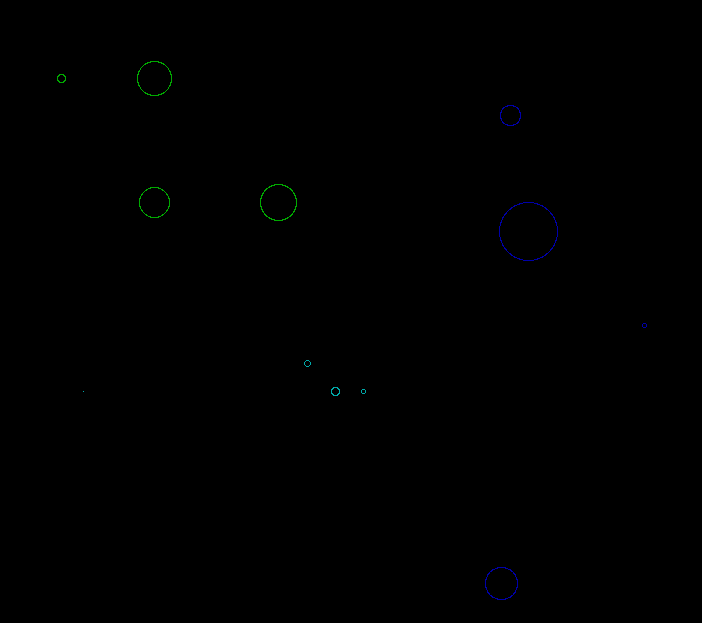

e3 - программа, которая принимает новое число и ставит его на своё место в цепочке в порядке возрастания;
e4 - Задача Иосифа

e5 - Шарики, которые летят и взрываются на много-много других шариков, которые взрываются на много-много-много других шариков, которые взрываются на много-много-много-много других шариков...

